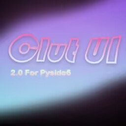
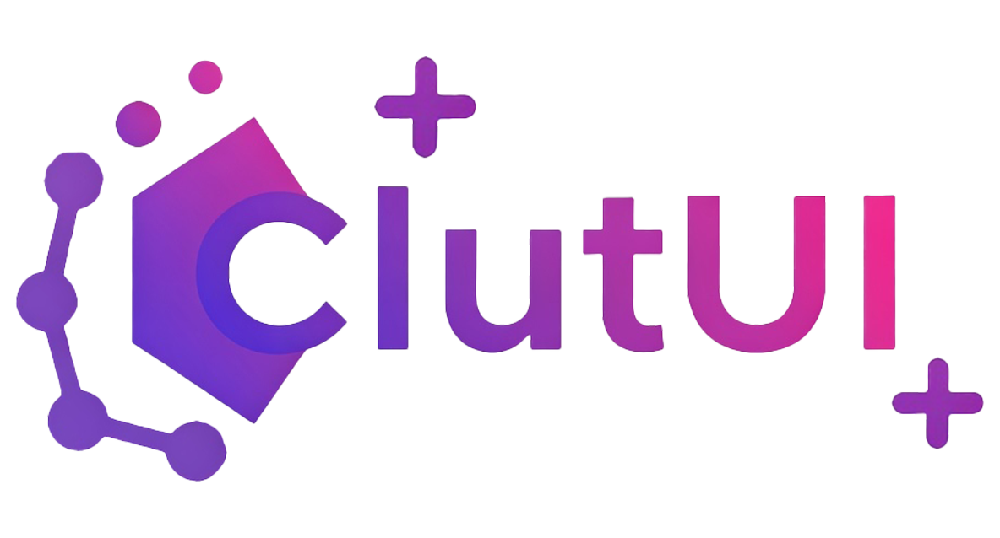

# ClutUI-Nextgen

---
  

## ✨ 项目特色
- **现代化设计**：采用Fluent Design风格，支持平滑动画过渡
- **模块化架构**：核心功能与UI组件完全解耦，方便扩展
- **智能日志系统**：实时监控+关键词高亮+统计面板

## 🚀 主要功能
### 1. 快速开始面板
- 智能卡片式导航
- 常用开发资源直达
- 动态数据展示

### 2. 关于页面
- 版本信息管理
- 多平台链接支持
- 优雅的排版设计

### 3. 核心能力
- 🎨 字体管理系统（支持动态适配亮/暗模式）
- 🌈 动画引擎（页面切换/数据变化动画）
- 📊 高性能日志系统（自动轮转+多级过滤）

## 🛠️ 技术栈 
- PySide6 - 跨平台GUI框架
- QSS - Qt样式表
- QPropertyAnimation - 动画系统
- RotatingFileHandler - 日志轮转
- Fluent Design - 界面设计规范
- Google Material Design - 界面设计规范
- Google Icons - 图标库

## 📚 参考资料
- [PySide6文档](https://doc.qt.io/qtforpython-6/index.html)
- [Qt样式表文档](https://doc.qt.io/qtforpython-6/PySide6/QtGui/QSS.html)
- [Qt动画系统文档](https://doc.qt.io/qtforpython-6/PySide6/QtCore/QPropertyAnimation.html)
- [日志轮转文档](https://docs.python.org/3/library/logging.handlers.html#logging.handlers.RotatingFileHandler)
- [Fluent Design文档](https://docs.microsoft.com/en-us/windows/apps/design/style/color)
- [Google Material Design文档](https://material.io/design)
- [Google Icons](https://fonts.google.com/icons)

## 🤝 参与贡献
欢迎提交PR！请遵循：
1. 新功能请配套单元测试
2. UI修改需提供预览图
3. 使用项目约定的日志系统

## 📄 许可证
* MIT License © 2024 ZZBuAoYe  
* Qt的版权是Qt公司，所以即使本项目是MIT协议，但是Pyside6的版权是Qt公司的，请遵守Qt公司的协议
* 请尊重项目元数据，保留原始版权信息(ฅ´ω`ฅ)

## 📫 联系我
- 邮箱：zzbuaoye@gmail.com

## 📝 版权声明
- 本项目由ZZBuAoYe开发,MIT协议,本项目可以随你使用，但是Pyside6的版权是Qt的，请遵守Qt公司的协议

## 📦 安装指南
- 请使用Python 3.12.x构建
- 运行时必须安装Pyside6这个核心库
- 建议刚开始不要修改项目结构容易混乱思绪
- 然后运行`python ClutUI_Nextgen_Main.py`即可

## 📦 打包指南
- 先安装PyInstaller最新版
- 然后使用PyInstaller打包
- 指令如下请在ClutUI_Nextgen_Main.py同级目录下执行
'''base
pyinstaller --noconfirm --onefile --windowed --icon="preview/logo.png" --add-data="MaterialIcons-Regular.ttf;." --add-data="core/font/icons/MaterialIcons-Regular.ttf;core/font/icons" --add-data="config;config" --add-data="core;core" --add-data="pages;pages" --add-data="preview;preview" --name="ClutUI_Nextgen" ClutUI_Nextgen_Main.py
'''
- 打包后运行`dist`下的`ClutUI_Nextgen_Main.exe`即可

## ✨ 对比1.0 / NextGen提升了什么
> 1.0特性
- 基于PyQt5开发的
- 存在众多bug和体验上的不适
- 没有自带的日志面板
- 没任何出色的设计
- 项目结构混乱
- 兼容性差
> NextGen特性
- 基于Pyside6开发的，所以2.0版本在性能上比1.0版本更加优秀
- 在设计上更为现代化，亮色主题和只能亮暗色文字带来更好的观感
- 日志功能集成进了核心能力中，可以实时监控和统计日志
- 采用Google Material Design的Icons给用户带来更好的体验
- 项目结构清晰，易于维护和扩展
- 项目为MIT协议，并且采用Google Material Design的Icons，这将会让项目更为易用免去了绘制图标的烦恼

## ❤️ LICENSE INFO AND THANKS TO:
- LGPL   Pyside6                © 2025 Qt Company | PySide6 
- Apache Google Material Design © 2025 Google     | Google Material Design
- MIT    ClutUI-Nextgen         © 2025 ZZBuAoYe   | ClutUI-Nextgen

## 🍞 END
- 感谢您的使用和支持，祝您开发愉快！
- Update 2025-02-04 17:45:02 (UTC+8)

