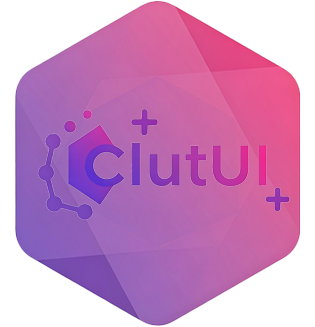

#  ClutUI-Nextgen

  

## ✨ 项目特色
- **现代化设计**：采用Fluent Design风格，支持平滑动画过渡
- **模块化架构**：核心功能与UI组件完全解耦，方便扩展
- **智能日志系统**：实时监控+关键词高亮+统计面板

## 🚀 主要功能
### 1. 快速开始面板
- 智能卡片式导航
- 常用开发资源直达
- 动态数据展示

### 2. 关于页面
- 版本信息管理
- 多平台链接支持
- 优雅的排版设计

### 3. 核心能力
- 🎨 字体管理系统（支持动态适配亮/暗模式）
- 🌈 动画引擎（页面切换/数据变化动画）
- 📊 高性能日志系统（自动轮转+多级过滤）

## 🛠️ 技术栈 
- PySide6 - 跨平台GUI框架
- QSS - Qt样式表
- QPropertyAnimation - 动画系统
- RotatingFileHandler - 日志轮转
- Fluent Design - 界面设计规范
- Google Material Design - 界面设计规范
- Google Icons - 图标库

## 📚 参考资料
- [PySide6文档](https://doc.qt.io/qtforpython-6/index.html)
- [Qt样式表文档](https://doc.qt.io/qtforpython-6/PySide6/QtGui/QSS.html)
- [Qt动画系统文档](https://doc.qt.io/qtforpython-6/PySide6/QtCore/QPropertyAnimation.html)
- [日志轮转文档](https://docs.python.org/3/library/logging.handlers.html#logging.handlers.RotatingFileHandler)
- [Fluent Design文档](https://docs.microsoft.com/en-us/windows/apps/design/style/color)
- [Google Material Design文档](https://material.io/design)
- [Google Icons](https://fonts.google.com/icons)
- [Numpy](https://numpy.org/doc/)
- [Pyinstaller](https://pyinstaller.org/en/stable/)
- [Pillow](https://pillow.readthedocs.io/en/stable/)
- [Python](https://www.python.org/)
- [Requests](https://requests.readthedocs.io/en/latest/)
- [Hitokoto](https://hitokoto.cn/api)

## 🤝 参与贡献
欢迎提交PR！请遵循：
1. 新功能请配套单元测试
2. UI修改需提供预览图
3. 使用项目约定的日志系统

## 📄 许可证
* MIT License © 2024 ZZBuAoYe  
* Qt的版权是Qt公司，所以即使本项目是MIT协议，但是Pyside6的版权是Qt公司的，请遵守Qt公司的协议
* 请尊重项目元数据，保留原始版权信息(ฅ´ω`ฅ)

## 📫 联系我
- 邮箱：zzbuaoye@gmail.com

## 📝 版权声明
- 本项目由ZZBuAoYe开发,MIT协议,本项目可以随你使用，但是Pyside6的版权是Qt的，请遵守Qt公司的协议

## 📦 安装指南
- 请使用Python 3.12.x构建
- 运行时必须安装Pyside6这个核心库
- 建议刚开始不要修改项目结构容易混乱思绪
- 然后运行`python ClutUI_Nextgen_Main.py`即可

## 📦 打包指南
- 获取[ClutUI_NextGen_BuildTools.bat](https://github.com/buaoyezz/ClutUI-Nextgen/blob/main/ClutUI_NextGen_BuildTools.bat)
- Tips: 本脚本不会自动按照项目所需库，但是会自动安装Pyinstaller以及Pillow
- 下载完成后,将`ClutUI_NextGen_BuildTools.bat`复制到你目录下与`ClutUI_Nextgen_Main.py`同级
- 直接运行`ClutUI_NextGen_BuildTools.bat`
- 等待程序编译完成
- 然后运行`dist`下的`ClutUI_Nextgen_Main.exe`即可

## 📦 Icons Map
- 预先打开`core` -> `font`目录
- 然后请先使用`download_codepoints.py`来下载`codepoints`文件
- 在然后使用`generate_icon_map.py`来生成`icon_map.py`文件
- Tips: 请不要手动修改`icon_map.py`内的内容，否则会导致图标无法显示，除非你知道你在做什么
> 当然你可以选择直接使用我预先生成的`icon_map.py`文件，他是原版的我并没有修改任何内容

## ❤️ LICENSE INFO AND THANKS TO:
- LGPL   Pyside6                © 2025 Qt Company | PySide6 
- Apache Google Material Design © 2025 Google     | Google Material Design
- MIT    ClutUI-Nextgen         © 2025 ZZBuAoYe   | ClutUI-Nextgen

## 🍞 END
- 感谢您的使用和支持，祝您开发愉快！
- Update 2025-02-04 17:45:02 (UTC+8)

# ClutUI-Nextgen 字体使用说明

## 使用的字体
1. HarmonyOS Sans SC (Regular & Bold)
   - 版权所有 © 2021-2024 华为技术有限公司
   - 商用授权协议：[华为鸿蒙字体商用授权协议](https://developer.harmonyos.com/cn/harmonyos_design)
   - 使用限制：不可修改，不可二次分发

2. Mulish (Regular & Bold)
   - 设计：Vernon Adams, Cyreal
   - 基于 SIL Open Font License 1.1
   - 许可协议：[SIL OFL 1.1](https://scripts.sil.org/OFL)
   - 使用限制：不可修改，不可二次分发

3. Material Icons
   - 版权所有 © 2014-2024 Google LLC
   - 基于 Apache License 2.0
   - 许可协议：[Apache 2.0](https://www.apache.org/licenses/LICENSE-2.0)
   - 使用限制：不可修改，不可二次分发

## 项目许可
- ClutUI-Nextgen：MIT License © 2025 ZZBuAoYe
- PySide6：LGPL-3.0 License © Qt Company

## 重要说明
1. 本项目虽采用 MIT 协议，但使用的字体和框架有各自的授权要求
2. PySide6 的使用需遵守 Qt 公司的协议
3. 字体的使用需严格遵守各自的授权协议

## 相关链接
- 项目主页：https://github.com/buaoyezz/ClutUI-Nextgen
- 许可协议：https://zzbuaoye.us.kg/clutui/font/license.txt
- 相关声明：https://zzbuaoye.us.kg/clutui/statement.txt

## 联系方式
如有任何授权相关问题，请联系：
- Email: zzbuaoye@gmail.com
- Website: https://zzbuaoye.us.kg

注意：其他具体限制范围请咨询相关部门，若字体使用协议有变更，请及时通知我使用邮箱

